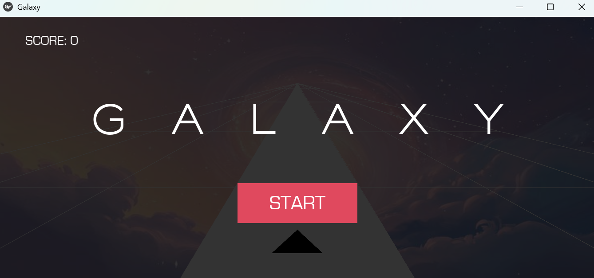

<h1 align="center">🌌 GALAXY</h1>

<p align="center">
  <b>Un jeu d'adresse développé en Python avec Kivy</b><br>
  Déplacez votre flèche, suivez le chemin, et tenez le plus longtemps possible !
</p>

---

## 🎮 Aperçu du jeu

<p align="center">
  
</p>

---

## 🚀 Installation

1. **Cloner le dépôt**
   ```bash
   git clone https://github.com/lemiae/galaxy.git
   cd galaxy


2. **Créer un environnement virtuel (recommandé)**
   ```bash
   python -m venv venv
   source venv/bin/activate
   venv\Scripts\activate
   ```bash


## ▶️ Lancer le jeu
python main.py

## 🎮 Contrôles

⬅️ Click gauche : déplacer à gauche

➡️ Click droite : déplacer à droite

🟥 Sortir de la piste = Game Over

## 🛠️ Technologies utilisées

Python

Kivy

## ✨ Features

- Musique de fond et des effets sonores

- Affichage du score du joueur

